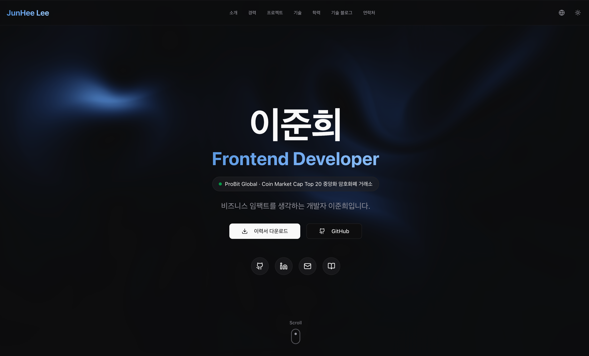

# My Dev Portfolio

클로드 코드를 통해 설계한 포트폴리오 웹사이트입니다. 배포를 포함한 클라이언트가 담당하는 전반적인 부분을 담았습니다.



## 주요 특징

- **다국어 지원** - 한국어/영어 전환 가능
- **다크 모드** - 라이트/다크/시스템 테마 지원
- **반응형 디자인** - 모바일, 태블릿, 데스크탑 대응
- **SEO 최적화** - 메타태그, sitemap, robots.txt, canonical URL 설정
- **Google Analytics** - 사용자 행동 및 이벤트 추적
- **404 페이지** - 커스텀 에러 페이지 (LiquidEther 배경)

## 기술 스택

| 분류      | 기술                      |
| --------- | ------------------------- |
| Framework | Next.js 16, React 19      |
| Language  | TypeScript                |
| Styling   | Tailwind CSS 4, shadcn/ui |
| Animation | Framer Motion             |
| i18n      | next-intl                 |
| Theme     | next-themes               |
| Analytics | Google Analytics 4        |

## 실행 방법

```bash
# 의존성 설치
pnpm install

# 개발 서버 실행 (http://localhost:3000)
pnpm dev

# 프로덕션 빌드
pnpm build

# 프로덕션 서버 실행
pnpm start

# 린트 검사
pnpm lint
```

## 프로젝트 구조

```
src/
├── app/                    # Next.js App Router
│   ├── [locale]/           # 다국어 라우팅 (ko, en)
│   │   ├── layout.tsx      # 로케일별 레이아웃
│   │   ├── page.tsx        # 메인 페이지
│   │   └── not-found.tsx   # 로케일별 404 페이지
│   ├── layout.tsx          # 루트 레이아웃 (폰트, 메타데이터, GA)
│   ├── not-found.tsx       # 루트 404 페이지
│   ├── globals.css         # 전역 스타일
│   ├── robots.ts           # robots.txt 생성
│   └── sitemap.ts          # sitemap.xml 생성
│
├── components/
│   ├── ui/                 # shadcn/ui 컴포넌트
│   ├── common/             # 공통 컴포넌트
│   │   ├── liquid-ether.tsx  # 배경 애니메이션
│   │   └── ascii-text.tsx    # ASCII 텍스트 효과
│   ├── layout/             # Header, Footer
│   ├── sections/           # 포트폴리오 섹션들
│   │   ├── hero.tsx        # 히어로 섹션
│   │   ├── about.tsx       # 소개 섹션
│   │   ├── experience.tsx  # 경력 섹션
│   │   ├── projects.tsx    # 프로젝트 섹션
│   │   ├── skills.tsx      # 기술 스택 섹션
│   │   ├── education.tsx   # 학력/자격증 섹션
│   │   ├── blog.tsx        # 블로그 섹션
│   │   └── contact.tsx     # 연락처 섹션
│   └── providers/          # Theme Provider
│
├── i18n/                   # 국제화 설정
│   ├── messages/           # 번역 파일 (ko.json, en.json)
│   ├── config.ts           # 로케일 설정
│   └── navigation.ts       # 다국어 네비게이션
│
├── lib/                    # 유틸리티 함수
│   ├── utils.ts            # cn() 유틸리티
│   ├── blog.ts             # 블로그 데이터 fetching
│   ├── fonts.ts            # 폰트 설정
│   └── gtag.ts             # Google Analytics 유틸리티
│
└── types/                  # TypeScript 타입 선언
    └── gtag.d.ts           # gtag 타입 정의
```

## 포트폴리오 섹션

1. **Hero** - 프로필 소개 및 CTA 버튼
2. **About** - 핵심 역량 및 비즈니스 임팩트
3. **Experience** - 경력 사항 (타임라인)
4. **Projects** - 주요 프로젝트 (SPOT, P2P, KYC 등)
5. **Skills** - 기술 스택 (React, Next.js, TypeScript 등)
6. **Education** - 학력 및 자격증
7. **Blog** - 최신 블로그 포스트
8. **Contact** - 연락처 및 소셜 링크
